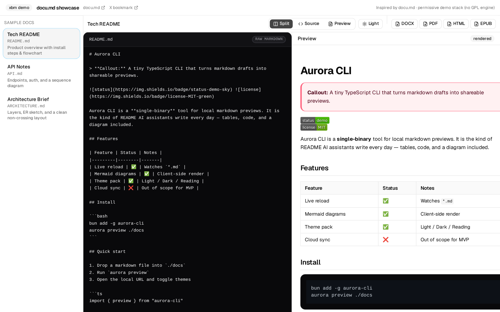
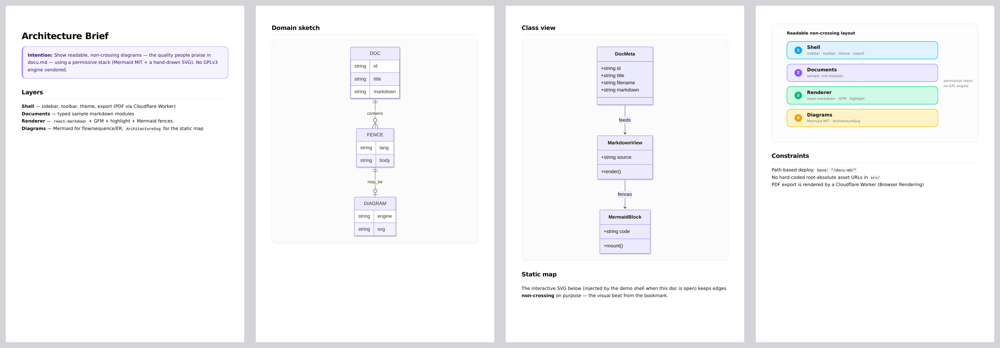

# docu.md

Single-page showcase of the **[docu.md](https://docu.md/)** product experience: open sample markdown docs, see a polished live preview with Mermaid diagrams, toggle themes, and export real PDFs (rendered by a small Cloudflare Worker) or standalone HTML — without vendoring any GPLv3 rendering engine.

Source pick: X post [kiwiflysky/status/2075195594797453646](https://x.com/kiwiflysky/status/2075195594797453646).



Video: [`artifacts/demo.webm`](./artifacts/demo.webm) · PDF export: [`artifacts/pdf-export.webm`](./artifacts/pdf-export.webm)



## What you get

| Beat | Detail |
|------|--------|
| Doc gallery | Tech README, API Notes, Architecture Brief |
| Side-by-side | Raw markdown ↔ rendered preview (split / source / preview) |
| Rich MD | Tables, fenced code, callouts, lists, links |
| Diagrams | Mermaid (MIT) flow / sequence / ER / class + a hand-drawn non-crossing architecture SVG |
| Themes | Light · Dark · Reading (warm paper) |
| Export | **PDF** — real, rendered by a Cloudflare Worker with Browser Rendering ([`worker/`](./worker/)) · **HTML** — real, client-side standalone file · DOCX / EPUB — labelled *mock* |

## Run

```bash
bun install
bun run dev      # http://localhost:5173/docu-md/
bun run build
bun run lint
```

PDF export calls `VITE_PDF_API` (default `https://docu-md-pdf.liyishan.workers.dev`), e.g. `VITE_PDF_API=http://localhost:8787 bun run dev`. Worker setup and deploy: [`worker/README.md`](./worker/README.md).

`vite.config.ts` sets `base: "/docu-md/"` so production lives at `https://li.yishan.app/docu-md/`.

## Built with DeepSeek

Component and shell code was written by [aider](https://aider.chat) driving **DeepSeek `deepseek-flash`** (OpenAI-compatible API) on the owner's key — one file per session, whole-file mode, then screenshot-based visual QA with Playwright. Sample docs, PLAN, README, scaffold, and prop/wiring fixes were hand-written by the agent.

## Credit & license note

Inspired by [docu.md](https://docu.md/) / [markdown-viewer-extension](https://github.com/markdown-viewer/markdown-viewer-extension) (**GPLv3** engines). This demo does **not** copy or vendor their rendering engine. Stack is permissive: React, `react-markdown`, `remark-gfm`, Mermaid (MIT), shadcn/ui, Tailwind.
