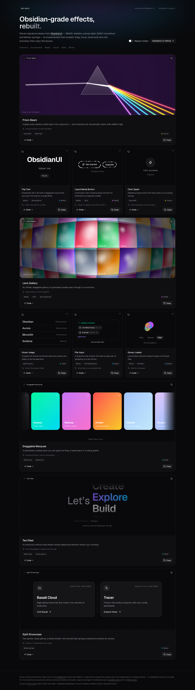

# obsidian-ui

Interactive showcase of **11 signature effects from [ObsidianUI](https://obsidianui.dev)** by Atharvsinh ([@athrix_codes](https://x.com/athrix_codes)) — an open-source React + Tailwind CSS library of components, blocks and landing-page templates built with Motion, GSAP and WebGL, installable through the shadcn CLI registry and documented for agents (`llms.txt`, Markdown pages, a local MCP server).

Where [`apps/spectrum-ui`](../spectrum-ui) is a light grid of small Motion components, this demo leans into what makes ObsidianUI different: **full-width hero-scale sections** (a refracting prism, a WebGL lensed gallery, GSAP marquee and text reel, spring-y split cards) interleaved with a card grid, on a dark "obsidian" theme.

Every card/section has a live, interactive preview, a description, a "how to interact" hint, tech badges, a source viewer and a **Copy** button. The copied code is the exact file running on the page (`src/blocks/<id>.tsx`, imported normally *and* as `?raw`). Everything respects `prefers-reduced-motion`, and the in-app **Reduce motion** switch previews that path (static frames, no drift or inertia; interactions still work).

Source pick: X post [athrix_codes/status/2104101588466074028](https://x.com/athrix_codes/status/2104101588466074028).



Video: [`artifacts/demo.webm`](./artifacts/demo.webm)

## Pieces

| # | Piece | Layout | Tech | What it does |
|---|-------|--------|------|--------------|
| 01 | Prism Beam | section | Canvas 2D | Drag to aim a white beam at a glass prism; per-wavelength Snell refraction fans it into a spectrum (additive glow, TIR handled, idle sweep) — after ObsidianUI's `v-prism` |
| 02 | Flip Text | card | Motion | Characters flip in 3D with a staggered wave on hover; single letters flip on their own |
| 03 | Liquid Metal Button | card | WebGL / GLSL | Pill button whose rim is flowing liquid chrome from a fragment shader; hover speeds the flow; pauses off-screen |
| 04 | Click Spark | card | Canvas 2D | Sparks + a ring burst from every click on an overlay canvas |
| 05 | Lens Gallery | section | WebGL / GLSL | Infinite grid of generated "studies" (Canvas 2D atlas → texture) seen through barrel distortion with chromatic edges; drag, fling, wheel, arrow keys — after `art-gallery` |
| 06 | Hover Image | card | GSAP `quickTo` | Project list whose thumbnail trails the pointer, tilts with velocity and slides to the hovered item |
| 07 | File Input | card | Motion | Dropzone morphing idle → drag-over → uploading → file list, with size validation and remove |
| 08 | Gooey Loader | card | Motion + SVG filter | Blobs orbit and merge through a goo filter; speed switch |
| 09 | Draggable Marquee | section | GSAP ticker | Seamless looping card track with drag momentum, hover slow-down and ← → keys |
| 10 | Text Reel | section | GSAP ticker | "Let's ___" word stream whose speed and direction follow page scroll / wheel, with a live speed meter — after `text-stream` |
| 11 | Split Showcase | section | Motion | Two partner cards split by a dotted divider; the hovered side springs outward and rounds its corners |

No three.js, postprocessing, lenis or shader packages: the WebGL pieces are raw `WebGLRenderingContext` + GLSL, the rest is Canvas 2D, GSAP core and Motion.

## Run

```bash
bun install
bun run dev      # http://localhost:5173
bun run build    # typecheck + production build
bun run lint     # oxlint
```

## Code layout

- `src/blocks/<id>.tsx` — one self-contained, copy-pasteable piece per file (imports only `react`, `motion/react`, `gsap`, `lucide-react` and `cn`).
- `src/demos/<id>.tsx` — tiny demo harness per piece.
- `src/blocks/index.ts` — registry (title, description, hint, category, tech, layout, demo, raw source); `src/blocks/types.ts` — the contract.
- `src/components/ShowcaseSection.tsx` (full-width), `ShowcaseCard.tsx` (grid), `SourcePanel.tsx` (code + copy).
- Reduced motion: `<MotionConfig reducedMotion>` in `App.tsx` + `useReducedMotionConfig()` in Motion blocks; GSAP / canvas / WebGL blocks take a `reducedMotion` prop (demos pass the Motion config value); CSS kill-switch in `index.css`.

## Built with DeepSeek

Like `spectrum-ui`, the component and app code was written by a coding CLI: **[aider](https://aider.chat) driving DeepSeek `deepseek-v4-pro`** (OpenAI-compatible API) on the owner's key. The agent wrote the plan, the `types.ts` contract, the conventions file and per-piece specs, ran one aider session per piece in parallel, reviewed every diff, did screenshot-based visual QA with Playwright and fixed what broke.

- **DeepSeek wrote:** all 11 blocks, all 11 demos, `App.tsx`, `ShowcaseSection.tsx`, `ShowcaseCard.tsx`, `SourcePanel.tsx`, the registry and `index.html` (~4,140 lines in the raw-output commit), plus a fix round in aider *diff* mode (+74 lines: pause the prism / lens loops off-screen, live reduced-motion toggling for the WebGL gallery).
- **Hand-written / hand-fixed by the agent (~130 lines):** `types.ts` contract, the CSS reduced-motion kill switch, and QA fixes — default→named imports, unused vars, StrictMode-safe WebGL cleanup (no `loseContext()` on a reused canvas), texture Y-flip, text-reel sizing + opacity falloff, GSAP `overwrite: "auto"` in Hover Image, the prism's exit-face Snell sign + internal-reflection bounces, a negative-radius guard in Click Spark, three missing credit headers, spacing and plurals.
- **Scaffold by official tools:** `bunx create-vite` (react-ts), `shadcn init` (radix-nova) + `shadcn add`.
- **Usage:** 15 aider sessions (one piece per request, 12 run in parallel), ≈ 70k input / 230k output tokens (output includes the model's reasoning).

## Credit & license note

Piece names and behaviour ideas come from [ObsidianUI](https://obsidianui.dev) ([Atharvsinh-codez/ObsidianUI](https://github.com/Atharvsinh-codez/ObsidianUI)), which is **MIT-licensed** (© 2026 ObsidianUI) — adapting its source would be permitted with the copyright notice. Even so, **no ObsidianUI source is included here**: every piece is an independent re-implementation written from the public names and one-line descriptions, without three.js or its other dependencies. Demo imagery is procedural (gradients), not ObsidianUI's assets. For the real library — components, blocks, landing templates, the shadcn registry, `llms.txt` and the MCP server — go to the source.

## Stack

Bun · Vite · React 19 · TypeScript · Tailwind v4 · shadcn/ui (radix-nova) · Motion · GSAP · raw WebGL · sonner · lucide-react

See [PLAN.md](./PLAN.md) for scope.
