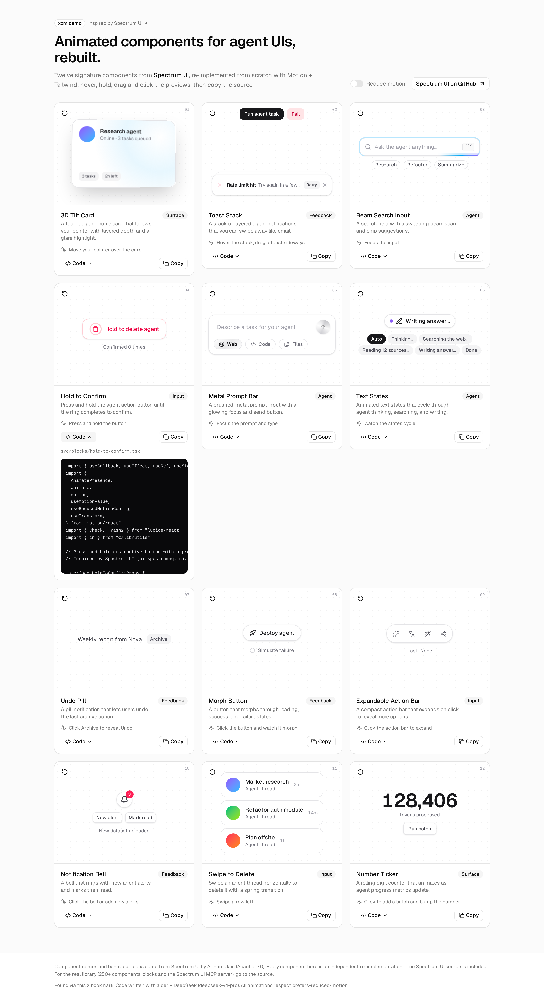

# spectrum-ui

Interactive showcase of **12 signature animated components for AI-agent UIs**, inspired by [Spectrum UI](https://ui.spectrumhq.in/) (by Arihant Jain) — an open-source library of 250+ animated React components and blocks built on shadcn/ui, Tailwind CSS and Motion, installable via the shadcn CLI or the Spectrum UI MCP server.

Every card has a live, interactive preview (hover, hold, drag, type), a one-line description, a "how to interact" hint, a source viewer and a **Copy** button. The copied code is the exact file running on the page (`src/blocks/<id>.tsx`, imported normally *and* as `?raw`). Everything respects `prefers-reduced-motion`, and there's an in-app **Reduce motion** toggle to preview that path.

Source pick: X bookmark [dingyi/status/2099784285775593630](https://x.com/dingyi/status/2099784285775593630).



Video: [`artifacts/demo.webm`](./artifacts/demo.webm)

## Components

| # | Component | Category | What it does |
|---|-----------|----------|--------------|
| 01 | 3D Tilt Card | Surface | Tilts toward the pointer with parallax depth layers and a moving glare |
| 02 | Toast Stack | Feedback | Stacked toasts; loading → success/error status morph, hover to expand, swipe to dismiss, per-toast auto-dismiss that pauses on hover |
| 03 | Beam Search | Agent | Search field whose bottom edge lights up with a travelling beam while focused |
| 04 | Hold to Confirm | Input | Press-and-hold destructive button; progress ring + fill, springs back on early release (pointer + keyboard) |
| 05 | Metal Prompt Bar | Agent | AI prompt composer with a rotating liquid-metal send button and toggleable tool chips |
| 06 | Text States | Agent | Agent status label that swaps text in place (exit up with blur, enter from below) with a colour-coded dot |
| 07 | Undo Pill | Feedback | Inline undo with a draining countdown ring that pauses on hover |
| 08 | Morph Button | Feedback | Async button morphing idle → loading → success / error (with shake) |
| 09 | Expandable Action Bar | Input | Icon toolbar whose actions expand into labels on hover/focus with a shared-layout highlight |
| 10 | Notification Bell | Feedback | Bell swings on new alerts; unread badge rolls its number |
| 11 | Swipe to Delete | Input | Drag a row left to reveal a delete action; long swipe deletes; keyboard Delete works too |
| 12 | Number Ticker | Surface | Rolling per-digit odometer with stagger and static separators |

## Run

```bash
bun install
bun run dev      # http://localhost:5173
bun run build    # typecheck + production build
bun run lint     # oxlint
```

## Code layout

- `src/blocks/<id>.tsx` — one self-contained, copy-pasteable component per file (imports only `react`, `motion/react`, `lucide-react` and `cn`).
- `src/demos/<id>.tsx` — tiny demo harness per component (buttons that fire toasts, counters, …).
- `src/blocks/index.ts` — registry (title, description, hint, category, demo, raw source).
- `src/components/ShowcaseCard.tsx` — preview / remount / source / copy card.
- Reduced motion: `<MotionConfig reducedMotion>` in `App.tsx` + `useReducedMotionConfig()` in every block (no loops, tilt or swings; functional behaviour stays).

## Built with DeepSeek

This is the first xbm demo whose component and app code was written by a coding CLI: **[aider](https://aider.chat) driving DeepSeek `deepseek-v4-pro`** (OpenAI-compatible API) on the owner's key. The agent wrote the plan, scaffold and per-component specs, reviewed every diff and visual QA screenshot, and sent fix rounds back to the model.

- **DeepSeek wrote:** all 12 blocks, all 12 demos, `ShowcaseCard.tsx`, `App.tsx`, the registry, `types.ts`, `index.html` (~2,550 lines), plus a round of visual-QA fixes (toast stack layout/z-order/timers, tilt glare + parallax, beam visibility, ticker clipping, swipe thresholds).
- **Hand-fixed by the agent (~40 lines):** toast title truncation + ref cleanup + id counter, beam-search controlled value (lint), ticker simplification + `aria-label`, missing credit headers, a pluralisation.
- **Scaffold by official tools:** `bunx create-vite` (react-ts), `shadcn init` (radix-nova) + `shadcn add`.
- **Usage:** 11 aider sessions (one request each), ≈ 79k input / 180k output tokens (≈ $0.8 at peak pricing).

## Credit & license note

Component names and behaviour ideas come from [Spectrum UI](https://ui.spectrumhq.in/) ([arihantcodes/spectrum-ui](https://github.com/arihantcodes/spectrum-ui)), which is licensed under **Apache-2.0** — adapting its source would be permitted with attribution. Even so, **no Spectrum UI source is included here**: every component is an independent re-implementation written from the public names and one-line descriptions only. For the real library (250+ components, blocks, templates and the Spectrum UI MCP server), go to the source.

## Stack

Bun · Vite · React 19 · TypeScript · Tailwind v4 · shadcn/ui (radix-nova) · Motion · sonner · lucide-react

See [PLAN.md](./PLAN.md) for scope.
