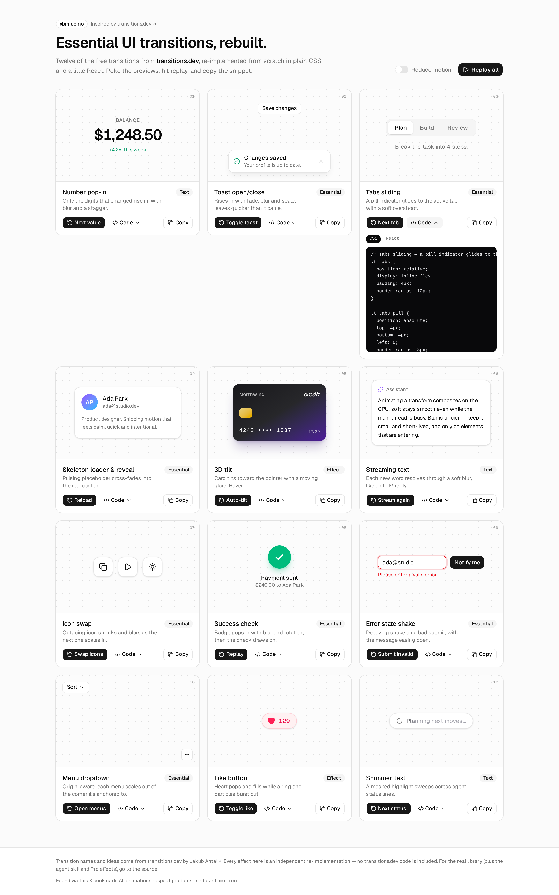

# transitions-dev

Interactive gallery of **12 essential UI transitions**, inspired by the free set on [transitions.dev](https://transitions.dev) (by Jakub Antalik) — a collection of copy-paste UI transitions for web apps, built to be used by AI coding agents via a skill.

Every card has a live preview, a replay / trigger button, a one-line description and a copyable CSS + React snippet. Everything respects `prefers-reduced-motion`, and there's an in-app **Reduce motion** toggle to preview that path.

Source pick: X bookmark [jonathan_wilke/status/2098801944756154391](https://x.com/jonathan_wilke/status/2098801944756154391).



Video: [`artifacts/demo.webm`](./artifacts/demo.webm)

## Transitions

| # | Transition | What it does |
|---|------------|--------------|
| 01 | Number pop-in | Only changed digits rise in with blur + stagger |
| 02 | Toast open/close | Rises in with fade, blur, scale; exits faster |
| 03 | Tabs sliding | Pill indicator glides to the active tab |
| 04 | Skeleton loader & reveal | Pulse → cross-fade to content |
| 05 | 3D tilt | Pointer-driven tilt with moving glare (hover it) |
| 06 | Streaming text | Words resolve through a soft blur |
| 07 | Icon swap | Scale + blur swap (copy/check, play/pause, sun/moon) |
| 08 | Success check | Badge pops with rotate + blur, check draws on |
| 09 | Error state shake | Decaying shake + message eases open |
| 10 | Menu dropdown | Origin-aware scale from the anchored corner |
| 11 | Like button | Heart pop, ring and particle burst |
| 12 | Shimmer text | Masked highlight sweeps agent status lines |

## Run

```bash
bun install
bun run dev      # http://localhost:5173
bun run build    # typecheck + production build
bun run lint     # oxlint
```

## Code layout

- `src/transitions/<name>.tsx` + `<name>.css` — one demo per transition. The CSS file is imported normally **and** as `?raw`, so the snippet you copy is exactly the CSS running on the page.
- `src/transitions/index.ts` — registry (title, description, category, trigger label).
- `src/components/TransitionCard.tsx` — preview / replay / code / copy card.
- `src/lib/motion.ts` — reduced-motion context, `useTrigger`, timeout helper.

## Credit & license note

Transition names and ideas come from [transitions.dev](https://transitions.dev). Its [terms](https://transitions.dev/terms.html) let you use transitions in your own products but not republish the collection, and its GitHub repo has no open-source license — so **no transitions.dev code is included here**. Every effect is an independent re-implementation. Pro transitions (confetti burst, gooey plus menu, …) are intentionally not recreated. For the real library, the agent skill (`npx skills add Jakubantalik/transitions.dev`) and Pro effects, go to the source.

## Stack

Bun · Vite · React 19 · TypeScript · Tailwind v4 · shadcn/ui (radix-nova) · sonner · lucide-react

See [PLAN.md](./PLAN.md) for scope.
